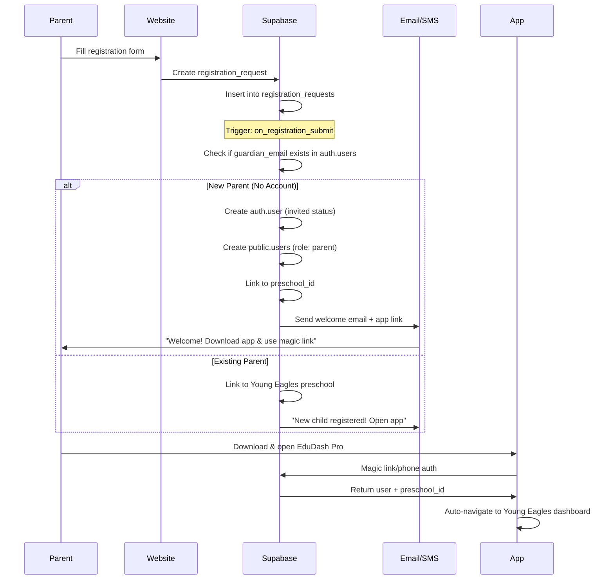

# Registration-App Sync Strategy: Young Eagles Integration

## 📋 Executive Summary

**Goal**: Seamless integration between EduSitePro registration forms and EduDash Pro mobile app, eliminating double registration and providing automatic school linking for parents.

**Current State**:
- ✅ Both systems share the same Supabase database
- ✅ Organization ID exists: `ba79097c-1b93-4b48-bcbe-df73878ab4d1` (Young Eagles)
- ✅ Registration system captures parent/child data in `registration_requests` table
- ❌ No automatic app onboarding after web registration
- ❌ Parents must register twice (web + app)

**Target State**:
- ✅ Parents register once on website
- ✅ Auto-provision app credentials via email/SMS
- ✅ Pre-link parent to Young Eagles in app
- ✅ Download app → Auto-login → Pre-linked school

---

## 🏗️ Architecture Overview

### Database Structure (Shared Supabase)

```
┌─────────────────────────────────────────────────────────────┐
│                    SUPABASE DATABASE                         │
│                 (bppuzibjlxgfwrujzfsz)                      │
└─────────────────────────────────────────────────────────────┘
                              │
                ┌─────────────┴─────────────┐
                │                           │
        ┌───────▼────────┐          ┌──────▼────────┐
        │  EduSitePro    │          │  EduDash Pro  │
        │  (Website CMS) │          │  (Mobile App) │
        └───────┬────────┘          └──────┬────────┘
                │                           │
                │                           │
    ┌───────────▼──────────┐    ┌──────────▼────────────┐
    │ registration_requests│    │ auth.users            │
    │ - organization_id    │    │ - email/phone         │
    │ - guardian_email     │    │ - metadata            │
    │ - guardian_phone     │    │                       │
    │ - child_info         │    │ public.users          │
    │ - status             │    │ - role: 'parent'      │
    └──────────────────────┘    │ - preschool_id        │
                                │ - auth_user_id        │
                                │                       │
                                │ public.preschools     │
                                │ - id (Young Eagles)   │
                                │ - organization_id     │
                                └───────────────────────┘
```

---

## 🔄 Proposed Integration Flow

### Phase 1: Post-Registration Automation



---

## 🛠️ Implementation Strategy

### Strategy A: **Database Trigger + Edge Function (RECOMMENDED)**

**✅ Pros:**
- Fully automated
- Real-time processing
- No manual intervention
- Scales automatically
- Maintains data integrity

**❌ Cons:**
- Requires Supabase Edge Function deployment
- More complex initial setup

#### Implementation Steps:

1. **Create Database Trigger**
```sql
-- File: supabase/migrations/20251121_registration_app_sync.sql

-- 1. Function to auto-provision app user
CREATE OR REPLACE FUNCTION auto_provision_app_user()
RETURNS TRIGGER AS $$
DECLARE
  v_auth_user_id UUID;
  v_preschool_id UUID;
BEGIN
  -- Only process approved/new registrations
  IF NEW.status NOT IN ('pending', 'approved') THEN
    RETURN NEW;
  END IF;

  -- Get Young Eagles preschool_id from organization_id
  SELECT id INTO v_preschool_id
  FROM preschools
  WHERE organization_id = NEW.organization_id
  LIMIT 1;

  -- Check if parent already exists in auth.users
  SELECT id INTO v_auth_user_id
  FROM auth.users
  WHERE email = NEW.guardian_email;

  -- If no auth user, create invited user
  IF v_auth_user_id IS NULL THEN
    -- Create invited user in auth.users (Supabase handles this via admin API)
    -- We'll use an Edge Function for this part
    
    INSERT INTO public.app_user_provisioning_queue (
      registration_request_id,
      guardian_email,
      guardian_phone,
      guardian_name,
      preschool_id,
      organization_id,
      status
    ) VALUES (
      NEW.id,
      NEW.guardian_email,
      NEW.guardian_phone,
      NEW.guardian_first_name || ' ' || NEW.guardian_last_name,
      v_preschool_id,
      NEW.organization_id,
      'pending'
    );
  ELSE
    -- User exists, just link to preschool
    INSERT INTO public.users (
      auth_user_id,
      email,
      full_name,
      role,
      preschool_id,
      organization_id
    ) VALUES (
      v_auth_user_id,
      NEW.guardian_email,
      NEW.guardian_first_name || ' ' || NEW.guardian_last_name,
      'parent',
      v_preschool_id,
      NEW.organization_id
    )
    ON CONFLICT (auth_user_id) DO UPDATE
    SET preschool_id = EXCLUDED.preschool_id;
  END IF;

  RETURN NEW;
END;
$$ LANGUAGE plpgsql SECURITY DEFINER;

-- 2. Create trigger
DROP TRIGGER IF EXISTS on_registration_submit ON registration_requests;
CREATE TRIGGER on_registration_submit
  AFTER INSERT OR UPDATE ON registration_requests
  FOR EACH ROW
  EXECUTE FUNCTION auto_provision_app_user();

-- 3. Create provisioning queue table
CREATE TABLE IF NOT EXISTS app_user_provisioning_queue (
  id UUID PRIMARY KEY DEFAULT gen_random_uuid(),
  registration_request_id UUID REFERENCES registration_requests(id),
  guardian_email TEXT NOT NULL,
  guardian_phone TEXT,
  guardian_name TEXT,
  preschool_id UUID,
  organization_id UUID,
  status TEXT DEFAULT 'pending', -- pending, processing, completed, failed
  auth_user_id UUID,
  error_message TEXT,
  created_at TIMESTAMPTZ DEFAULT NOW(),
  processed_at TIMESTAMPTZ
);

CREATE INDEX idx_provisioning_queue_status ON app_user_provisioning_queue(status);
```

2. **Create Supabase Edge Function**
```typescript
// File: supabase/functions/process-app-provisioning/index.ts

import { serve } from "https://deno.land/std@0.177.0/http/server.ts"
import { createClient } from 'https://esm.sh/@supabase/supabase-js@2'

serve(async (req) => {
  try {
    const supabaseClient = createClient(
      Deno.env.get('SUPABASE_URL') ?? '',
      Deno.env.get('SUPABASE_SERVICE_ROLE_KEY') ?? ''
    )

    // Get pending provisioning requests
    const { data: queue, error: queueError } = await supabaseClient
      .from('app_user_provisioning_queue')
      .select('*')
      .eq('status', 'pending')
      .limit(10)

    if (queueError) throw queueError

    for (const item of queue) {
      try {
        // Update status to processing
        await supabaseClient
          .from('app_user_provisioning_queue')
          .update({ status: 'processing' })
          .eq('id', item.id)

        // Create auth user via Admin API
        const { data: authData, error: authError } = await supabaseClient.auth.admin.createUser({
          email: item.guardian_email,
          email_confirm: false, // Send confirmation email
          user_metadata: {
            full_name: item.guardian_name,
            preschool_id: item.preschool_id,
            organization_id: item.organization_id,
            onboarding_source: 'website_registration'
          },
          app_metadata: {
            provider: 'email',
            providers: ['email']
          }
        })

        if (authError) throw authError

        // Create public.users record
        const { error: userError } = await supabaseClient
          .from('users')
          .insert({
            auth_user_id: authData.user.id,
            email: item.guardian_email,
            full_name: item.guardian_name,
            role: 'parent',
            preschool_id: item.preschool_id,
            organization_id: item.organization_id
          })

        if (userError) throw userError

        // Mark as completed
        await supabaseClient
          .from('app_user_provisioning_queue')
          .update({ 
            status: 'completed',
            auth_user_id: authData.user.id,
            processed_at: new Date().toISOString()
          })
          .eq('id', item.id)

        // Send welcome email with app download link
        await supabaseClient.functions.invoke('send-welcome-email', {
          body: {
            email: item.guardian_email,
            name: item.guardian_name,
            appDownloadUrl: 'https://play.google.com/store/apps/details?id=com.edudashpro',
            schoolName: 'Young Eagles Day Care'
          }
        })

      } catch (err) {
        console.error(`Failed to provision user for ${item.guardian_email}:`, err)
        await supabaseClient
          .from('app_user_provisioning_queue')
          .update({ 
            status: 'failed',
            error_message: err.message,
            processed_at: new Date().toISOString()
          })
          .eq('id', item.id)
      }
    }

    return new Response(
      JSON.stringify({ processed: queue.length }),
      { headers: { "Content-Type": "application/json" } }
    )
  } catch (error) {
    return new Response(
      JSON.stringify({ error: error.message }),
      { status: 400, headers: { "Content-Type": "application/json" } }
    )
  }
})
```

3. **Schedule Edge Function**
```bash
# Run every 5 minutes via cron job or Supabase pg_cron
SELECT cron.schedule(
  'process-app-provisioning',
  '*/5 * * * *', -- Every 5 minutes
  $$ SELECT net.http_post(
    url := 'https://bppuzibjlxgfwrujzfsz.supabase.co/functions/v1/process-app-provisioning',
    headers := '{"Content-Type": "application/json", "Authorization": "Bearer SERVICE_ROLE_KEY"}'::jsonb
  ) $$
);
```

---

### Strategy B: **Webhook to External Service**

**✅ Pros:**
- Can use existing infrastructure
- Easier debugging
- More flexible email/SMS providers

**❌ Cons:**
- Requires external server
- Additional hosting costs
- More points of failure

---

### Strategy C: **Manual Admin Approval Flow**

**✅ Pros:**
- Full control
- Manual verification
- No automation risks

**❌ Cons:**
- Not scalable
- Slow parent onboarding
- Manual work required

---

## 📱 App Deep Linking Strategy

### iOS/Android Deep Links

```typescript
// App.tsx or navigation setup

import { Linking } from 'react-native'

// Handle incoming deep links
Linking.getInitialURL().then(url => {
  if (url) {
    handleDeepLink(url)
  }
})

Linking.addEventListener('url', ({ url }) => {
  handleDeepLink(url)
})

function handleDeepLink(url: string) {
  // edudashpro://onboarding?email=parent@example.com&preschool_id=xxx&token=yyy
  
  const { queryParams } = parseDeepLink(url)
  
  if (queryParams.token) {
    // Auto-login with magic link token
    await supabase.auth.verifyOtp({
      token_hash: queryParams.token,
      type: 'magiclink'
    })
    
    // Navigate to preschool dashboard
    navigation.navigate('Dashboard', {
      preschoolId: queryParams.preschool_id
    })
  }
}
```

### Email Template

```html
<!DOCTYPE html>
<html>
<head>
  <title>Welcome to Young Eagles</title>
</head>
<body>
  <h1>Welcome to Young Eagles Day Care!</h1>
  
  <p>Hi {{parent_name}},</p>
  
  <p>Thank you for registering {{child_name}}! Your application is being reviewed.</p>
  
  <h2>📱 Download the EduDash Pro App</h2>
  <p>Stay connected with real-time updates, photos, and communication:</p>
  
  <a href="https://play.google.com/store/apps/details?id=com.edudashpro">
    
  </a>
  
  <h3>Quick Setup (1-Click)</h3>
  <a href="edudashpro://onboarding?email={{email}}&preschool_id={{preschool_id}}&token={{magic_link_token}}">
    Open App & Auto-Login
  </a>
  
  <p><small>Or use this code when signing up: <strong>YE-2026</strong></small></p>
</body>
</html>
```

---

## ✅ Recommended Implementation Plan

### Phase 1: Foundation (Week 1)
- [ ] Create `app_user_provisioning_queue` table
- [ ] Create database trigger `auto_provision_app_user()`
- [ ] Test trigger with sample registration

### Phase 2: Edge Function (Week 1-2)
- [ ] Deploy `process-app-provisioning` Edge Function
- [ ] Set up cron job for automatic processing
- [ ] Create email template for welcome messages

### Phase 3: App Integration (Week 2)
- [ ] Add deep link handling to React Native app
- [ ] Test magic link auto-login flow
- [ ] Implement preschool pre-linking

### Phase 4: Testing & Rollout (Week 3)
- [ ] End-to-end testing with test accounts
- [ ] Monitor provisioning queue for errors
- [ ] Gradual rollout to real parents

---

## 🔒 Security Considerations

1. **Email Verification**: Parents must verify email before app access
2. **Magic Link Expiry**: Tokens expire after 24 hours
3. **RLS Policies**: Enforce tenant isolation in app queries
4. **Rate Limiting**: Prevent abuse of provisioning system

---

## 📊 Success Metrics

- **Registration Completion Rate**: % of web registrations that download app
- **Time to First App Login**: Hours between registration and app login
- **Parent Satisfaction**: NPS score for onboarding experience
- **Support Tickets**: Reduction in "how do I access the app?" tickets

---

## 🚀 Next Steps

1. **Review this document** with the team
2. **Choose strategy** (Recommended: Strategy A)
3. **Set up development environment**
4. **Create database migrations**
5. **Deploy Edge Functions**
6. **Test with staging accounts**
7. **Roll out to production**

---

## 📞 Support

For questions or assistance:
- Email: dev@edudashpro.org.za
- GitHub Issues: K1NG-COM-WEB/youngeagles-education-platform
